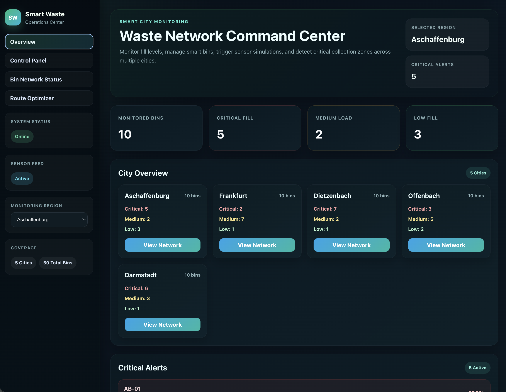
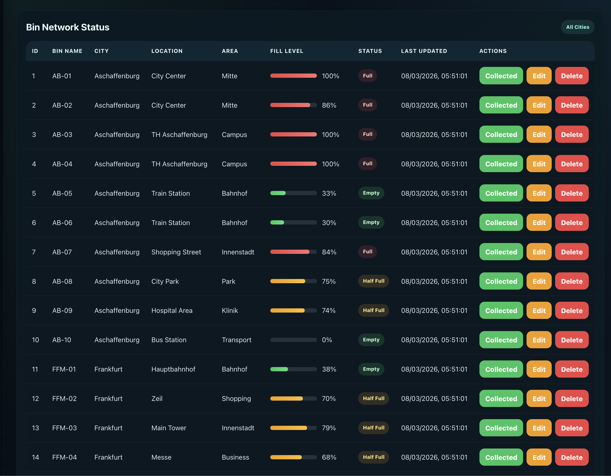
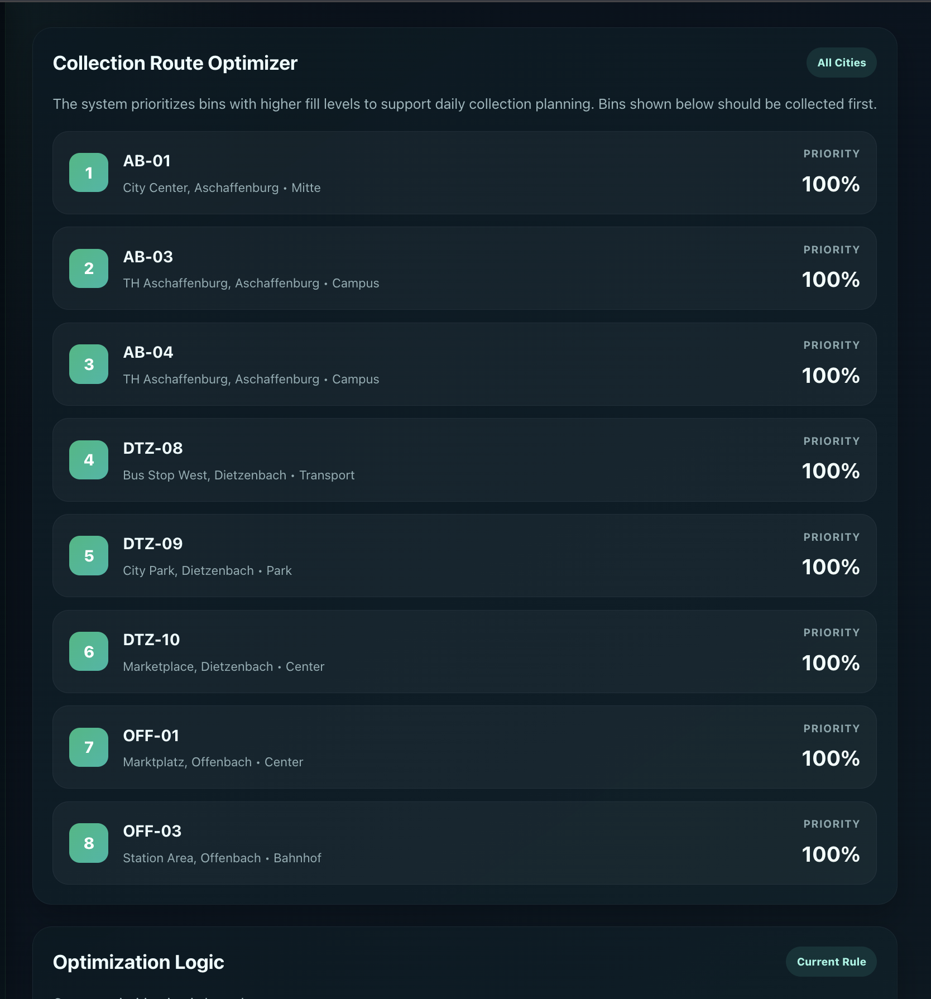

# Smart Waste Management Dashboard

A smart‑city monitoring system that tracks garbage bin fill levels across multiple cities and helps optimize waste collection routes.

This project simulates an IoT‑based waste management platform where smart bins send data to a central dashboard used by city operators.

---

## Dashboard Preview

### Overview


### Bin Network


### Route Optimizer


---

## Features

- Smart bin monitoring across multiple cities
- Real‑time fill level tracking
- Critical alerts for bins above 80%
- Route prioritization for waste collection
- Add / edit / delete smart bins
- Sensor simulation for IoT data testing

---

## Tech Stack

**Frontend**
- React
- Axios
- CSS

**Backend**
- FastAPI
- SQLAlchemy
- SQLite

---

## Architecture

React Dashboard → FastAPI API → SQLite Database

---

## Run Locally

### Backend

```
cd backend
pip install -r requirements.txt
uvicorn app.main:app --reload --port 8002
```

### Frontend

```
cd frontend
npm install
npm run dev
```

---

## Author

Safeer Ahmad  
Software Design International – TH Aschaffenburg

GitHub: https://github.com/safeerahmad12  
Portfolio: https://safeerahmad12.github.io/safeer-portfolio/

---

This project was built as a portfolio demonstration of full‑stack development using React and FastAPI.